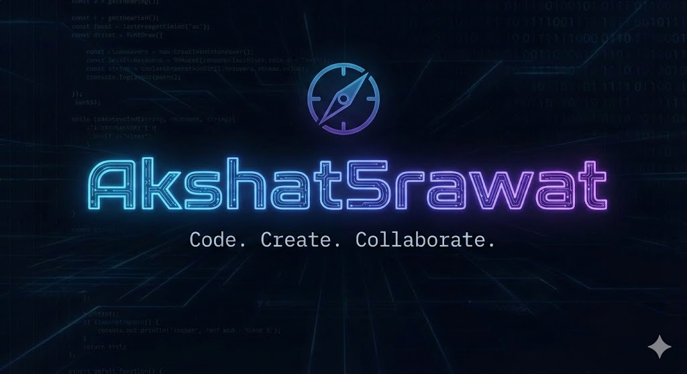

  

  <h1 align="center">Hi there, I'm Akshat Rawat! </h1>
  
  

    
  

  
  

    
    
  

---

### 🚀 About Me

- 🔭 I’m currently working on AI-powered-cloud-storage
- 🌱 I’m currently learning Backend
- 💬 Ask me about web devlopment
- 🎓 Education: CS Student at Shivalik College of Engineering
- 🤝 Open to: Internships and Jobs

---

### 🛠️ Tech Stack

---

### 📊 GitHub Stats

  <!-- GitHub Readme Stats (vercel) -->
  
  <!-- Top languages -->
  

  <!-- Replaced unstable heroku streak badge with a stable trophy badge -->
  

---

  
Thanks for visiting my profile!

  

